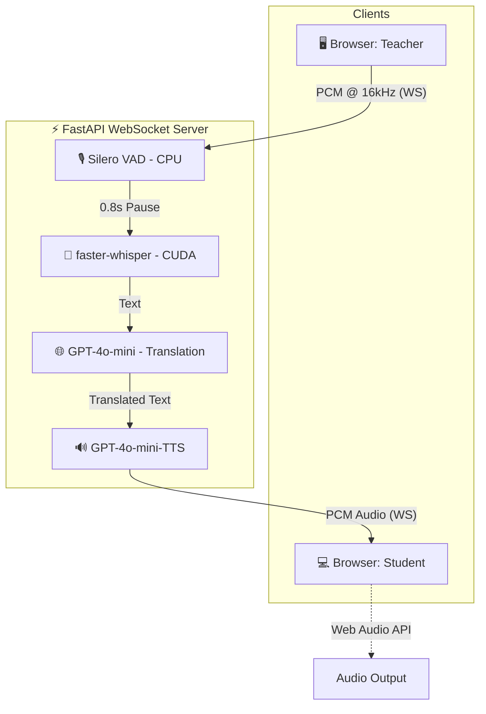

# 🎓 Classroom Translator

> Real-time bidirectional **English ↔ Urdu** translation for live classroom use — powered by Whisper large-v3, Silero VAD, GPT-4o-mini, and GPT-4o-mini-TTS.

---

## ✨ Features

- 🎙️ **Silence-gated transcription** — Silero VAD detects natural speech boundaries before firing Whisper, so sentences are never cut off mid-thought
- 🔄 **Bidirectional** — Teacher speaks English → Student hears Urdu; Student speaks Urdu → Teacher hears English
- 🏫 **Floor control** — Teacher holds the floor by default; Student raises hand, Teacher grants access
- ⚡ **Fully pipelined** — VAD → Whisper → GPT-4o translation → TTS streaming run concurrently with zero blocking
- 🔊 **Streaming TTS** — Audio chunks stream to the browser in real time via WebSocket, no buffering delay
- 🧠 **Technical term preservation** — CS/engineering terms (encoder, transformer, polymorphism…) are kept in English in the Urdu output

---

## 🏗️ Architecture



---

## 🚀 Quick Start

### Run on Kaggle (Recommended — free GPU)

1. Open the notebook in Kaggle: [](https://kaggle.com/YOUR_USERNAME/classroom-translator)
2. Add your secrets in **Kaggle → Add-ons → Secrets**:
   - `OPENAI_API_KEY`
   - `NGROK_TOKEN`
3. Enable **GPU T4 x2** accelerator
4. Run all cells
5. Open the printed `/teacher` and `/student` URLs in separate browser tabs

### Run on Google Colab

1. Upload `notebooks/classroom_translator.ipynb` to Colab
2. Set your API keys as Colab secrets or paste directly into the config block
3. Set runtime to **GPU**
4. Run all cells

---

## 🔑 Environment Variables / Secrets

| Secret | Where to get it |
|--------|----------------|
| `OPENAI_API_KEY` | [platform.openai.com/api-keys](https://platform.openai.com/api-keys) |
| `NGROK_TOKEN` | [dashboard.ngrok.com](https://dashboard.ngrok.com) |

---

## 🛠️ Tech Stack

| Component | Technology |
|-----------|-----------|
| Speech-to-Text | [faster-whisper](https://github.com/guillaumekln/faster-whisper) large-v3 |
| Voice Activity Detection | [Silero VAD](https://github.com/snakers4/silero-vad) |
| Translation | OpenAI GPT-4o-mini |
| Text-to-Speech | OpenAI GPT-4o-mini-TTS |
| Backend | FastAPI + WebSockets |
| Tunnel | ngrok |
| Frontend | Vanilla JS + Web Audio API |

---

## 📡 How It Works

1. **Teacher** opens `/teacher` in their browser — microphone streams PCM audio over WebSocket
2. **Silero VAD** runs on every 512-sample frame, accumulating speech into a buffer
3. After **0.8s of silence**, the complete utterance is sent to **Whisper large-v3** for transcription
4. The transcript goes to **GPT-4o-mini** for English→Urdu translation
5. The Urdu text is streamed through **GPT-4o-mini-TTS** and PCM chunks are sent to the Student's browser
6. **Student** can raise their hand → Teacher grants the floor → process reverses (Urdu→English)

---

## ⚙️ Configuration

In the notebook, you can tune these VAD constants:

```python
VAD_SPEECH_THRESH  = 0.5   # Silero confidence to classify as speech
SILENCE_FIRE_SECS  = 0.8   # pause duration before firing transcription
SILENCE_RESET_SECS = 2.0   # pause duration before full utterance reset
MIN_SPEECH_SECS    = 0.3   # minimum speech to bother transcribing
```

---

## 📋 Requirements

```
fastapi>=0.110.0
uvicorn>=0.29.0
websockets>=12.0
pyngrok>=7.0.0
openai>=1.30.0
faster-whisper>=1.0.0
torch>=2.2.0
numpy>=1.26.0
nest-asyncio>=1.6.0
```

---

## 🤝 Contributing

Pull requests are welcome. For major changes, please open an issue first.

---

## 📄 License

[MIT](LICENSE)
